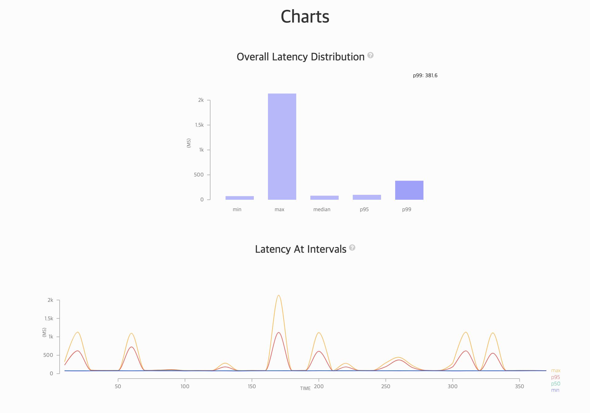

# CPU bound application

## Artillery로 성능 측정하기

### 시작하기

```bash
npm install -g artillery #Artillery 설치하기
artillery run --output report.json cpu-test.yaml #테스트 실행 -> json 파일 생성
artillery report ./report.json #json 파일 -> html로 변환해서 실행하기
```

### Artillery 스크립트

```bash
config:
  target: "http://34.64.213.244"
  phases:
    - duration: 60
      arrivalRate: 2
      name: Warm up
scenarios:
  # We define one scenario:
  - name: "Just get hash"
    flow:
      # Get the details of the product:
      - get:
          url: "/hash/123"
```

### Scale-up 후, 성능 테스트



- `e2-micro(vCPU 2개, 1GB 메모리)` -> `e2-highmem-8(vCPU 8개, 64GB 메모리)`
- `duration:360, arrivalRate:2`로 설정하니 안정적으로 트래픽을 받을 수 있었다.
- 튀는 구간이 있는데 이는 VM을 사용하기 때문에 어쩔 수 없는 것 같다. PM과 달리 VM은 인접한 인스턴스와 자원을 공유하기 때문에 이런 현상이 발생할 수 있다.

### 성능 테스트하기 위한 기준 만들기

- 내가 예상하는 TPS보다 여유롭게 설정
- 기대 Latency를 만족할 때까지 성능 테스트하기
  - 단일 요청 레이턴시가 기대 레이턴시보다 높다면, Scale-out으로 해결되지 않는다. 따라서 코드가 비효율적이나, I/O가 병목이거나, 네트워크에서 레이턴시가 발생할 수 있다. 따라서 다양한 부분들을 고려할 수 있어야 한다.
- Scale-out해도 성능이 늘지 않으면 병목을 의심하자.

### 그래프 각 선의 의미

- **[max]** 가장 오래 걸린 요청 → 응답시간
- **[p95]** 전체 HTTP 트랜잭션 중 가장 빠른것부터 95%까지 (대부분의 트래픽)
- **[p50]** 전체 HTTP 트랜잭션 중 가장 빠른것부터 50%까지 (절반 트래픽)
- **[min]** 가장 빠르게 온 요청 → 응답시간

### 실제 밴치마크를 잴 때 어떤 것을 주로 사용하는가? 
- 실제 벤치마크를 잴 때 **p99와 p95 두가지 그래프를 많이 그린다.**
  p99는 대부분 트래픽이 해당되기 때문에 실제 애플리케이션 성능에 가깝기 때문이다.
- max는 네트워크는 상당히 불안정한 존재이기 때문에 전체 성능 측정 결과에 영향을 미치는 것이 바람직하지 않다.